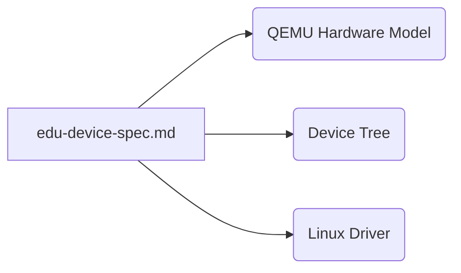
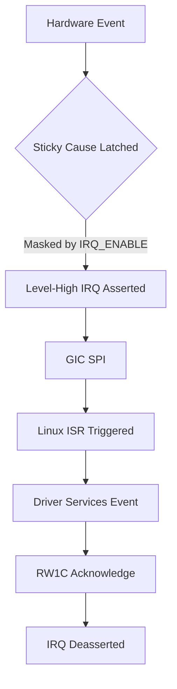
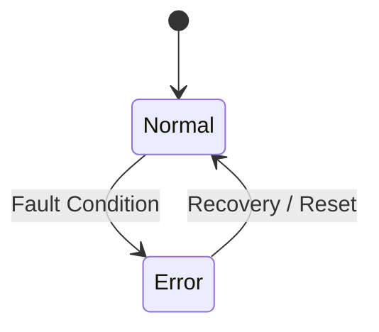
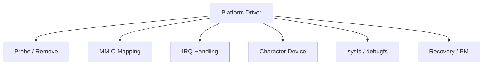
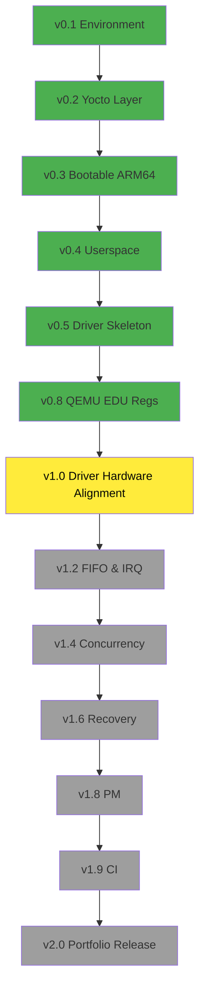

# Embedded Linux Platform

A comprehensive, production-style Embedded Linux environment demonstrating end-to-end full stack development from virtual hardware modeling in QEMU to a custom Linux platform driver, and userspace diagnostics.


## Overview

This repository houses a portfolio-quality Embedded Linux project. The project demonstrates a full-stack embedded development flow by modeling a virtual educational peripheral ("EDU device") in QEMU, driving it with a custom Linux platform driver, exposing its capabilities to userspace via a character device and sysfs/debugfs, and orchestrating the entire build with a custom Yocto (Poky) layer.

It goes beyond basic tutorials by dealing with actual hardware/software contracts, deterministic error handling, interrupt synchronization, concurrency, and device tree integration.

## System Architecture

```mermaid
graph TD
    subgraph Userspace
        A[edu-cli]
    end
    subgraph Kernel Space
        B[/dev/edu0]
        C[Linux EDU Driver]
        D[Device Tree]
    end
    subgraph Virtual Hardware
        E[QEMU EDU Device]
        F[QEMU ARM64 Machine]
    end

    A <-->|read/write/ioctl| B
    B --- C
    C -->|Reads Config| D
    C <-->|MMIO / IRQ| E
    E --- F
```

The system spans all layers of an embedded target:
- **Yocto / Poky**: Defines the root filesystem, kernel build, and packaging.
- **Linux Kernel**: Manages the hardware resources and hosts the platform driver.
- **Device Tree**: Configures the base address (proposed `0x20000000`) and GIC SPI interrupt.
- **QEMU**: A modified QEMU `v8.2.7` acts as the hardware, exposing deterministic virtual MMIO registers and interrupts.
- **Linux Driver**: Translates raw hardware state into a safe userspace ABI.
- **Userspace**: `edu-cli` interacts with the driver to perform functional testing and fault injection.

## EDU Virtual Hardware

The EDU peripheral is a virtual device designed specifically for this project. Rather than relying on simple software stubs, this project enforces a strict hardware/software contract by executing a real device model in QEMU. This forces the driver to handle real-world scenarios: MMIO validation, hardware state machines, asynchronous interrupts, sticky errors, and FIFO overflows.

### Hardware / Software Contract

The authoritative hardware specification is defined in [`docs/edu-device-spec.md`](docs/edu-device-spec.md).



## MMIO Register Map

The peripheral occupies a 4 KiB region, naturally aligned.

| Offset | Register | Access | Reset | Description | Status |
|---|---|---|---|---|---|
| `0x00` | `CONTROL` | RW | `0x00000000` | Enable, reset, IRQ enable | ✅ |
| `0x04` | `STATUS` | RO | `0x00000001` | Ready, data available, error | ✅ |
| `0x08` | `DATA` | RW | `0x00000000` | FIFO producer/consumer | ⏳ |
| `0x0C` | `IRQ_STATUS` | RW1C | `0x00000000` | Latched interrupt causes | ⏳ |
| `0x10` | `IRQ_ENABLE` | RW | `0x00000000` | Interrupt mask | ⏳ |
| `0x14` | `VERSION` | RO | `0x00010000` | Hardware contract version | ✅ |
| `0x18` | `FIFO_LEVEL` | RO | `0x00000000` | Queued words count | ⏳ |
| `0x1C` | `ERROR_STATUS` | RW1C | `0x00000000` | Latched error causes | ⏳ |

> **Note:** The QEMU implementation of the `CONTROL`, `STATUS`, and `VERSION` registers is complete (Stage 2). FIFO and IRQ integration are planned for the next stage. The Linux driver currently relies primarily on software state and is actively being aligned to the hardware model.

### CONTROL / STATUS

```mermaid
bitField
  LITTLEENDIAN
  FIELD ENABLE: 1
  FIELD RESET: 1
  FIELD IRQ_ENABLE: 1
  FIELD RESERVED: 29
```

## FIFO Data Model

The device models a 128-entry (32-bit word) hardware FIFO.

```mermaid
graph LR
    A[Producer (Write)] -->|DATA| B[FIFO: 128 x 32-bit]
    B -->|DATA| C[Consumer (Read)]
```
*Status:* ⏳ Planned (Next milestone).

## Interrupt Architecture


*Status:* 🟡 Linux driver implements IRQ plumbing; QEMU generation planned.

## Error / Recovery

The device and driver model deterministic recovery. Errors such as invalid operations or FIFO overflows latch into `ERROR_STATUS`, firing an interrupt. The driver acknowledges the fault and exposes it via sysfs/debugfs without corrupting normal device state.


*Status:* 🟡 Software-level simulated fault injection exists; hardware integration planned.

## Linux Driver


*Status:* 🟡 Basic character device, MMIO init, and diagnostic hooks exist, but need alignment to the hardware state machine.

## Userspace Interface

```mermaid
graph TD
    A[edu-cli] -->|read/write/ioctl| B[/dev/edu0]
    B --> C[Linux driver]
    C --> D[EDU device]
```
The `edu-cli` coordinates with the kernel device via ioctl and simple file operations to probe, reset, read, write, and inject faults.

## Boot Flow

```mermaid
graph TD
    A[Yocto Build] --> B[Kernel + DTB + rootfs]
    B --> C[QEMU execution]
    C --> D[Linux Boot]
    D --> E[Device Tree Parses]
    E --> F[QEMU EDU Device Probed]
    F --> G[Driver Loads]
    G --> H[/dev/edu0 Created]
    H --> I[edu-cli Userspace]
```

## Yocto Architecture

The project maintains a custom layer `meta-embedded-lab` to integrate the pieces.

```text
meta-embedded-lab/
 ├── conf/
 ├── recipes-apps/
 │    └── edu-cli/           # Userspace diagnostic utility
 ├── recipes-core/
 │    └── images/            # Custom ARM64 minimal image
 ├── recipes-drivers/
 │    └── edu-device/        # Out-of-tree Linux kernel module
 └── recipes-kernel/
      └── linux/             # Device tree overlay / kernel config
```

## QEMU Development

The project uses QEMU `v8.2.7` integrated as a Git submodule, pinned to commit `317c999868dfbc6e4630a39ca10cf189b81d17ad`. It uses an out-of-tree build wrapper (`tools/build-qemu.sh`). An integrated QEMU fork allows us to experiment with virtual hardware side-by-side with driver development.

See [docs/qemu-development.md](docs/qemu-development.md).

## Project Structure

```text
embedded-linux-platform/
 ├── docs/                   # Architecture and specs
 ├── meta-embedded-lab/      # Custom Yocto layer
 ├── qemu/                   # QEMU v8.2.7 (submodule)
 ├── tools/                  # Build scripts
 └── README.md
```

## Build

1. **Clone and initialize:**
   ```bash
   git clone https://github.com/abhijeet8684-beep/embedded-linux-platform.git
   cd embedded-linux-platform
   git submodule update --init --recursive
   ```

2. **Build QEMU:**
   ```bash
   ./tools/build-qemu.sh
   ```

3. **Build Yocto Image:**
   (Requires Poky setup at `../poky`)
   ```bash
   source ../poky/oe-init-build-env
   bitbake embedded-lab-image
   ```

4. **Run QEMU:**
   ```bash
   # Use the newly built QEMU
   ~/.cache/embedded-linux-platform/qemu-8.2.7/qemu-system-aarch64 -M virt -cpu cortex-a53 ...
   ```

## Current Status

| Component | Status |
|---|---|
| Yocto environment | ✅ |
| Custom Yocto layer | ✅ |
| ARM64 image | ✅ |
| edu-cli | ✅ |
| Linux driver | 🟡 |
| QEMU integration | ✅ |
| EDU QEMU skeleton | ✅ |
| MMIO | 🟡 |
| FIFO | ⏳ |
| IRQ | ⏳ |
| Error handling | ⏳ |
| Recovery | ⏳ |
| PM | ⏳ |
| CI | ⏳ |

## Roadmap



## Engineering Concepts Demonstrated

| Domain | Concepts Applied |
|---|---|
| **Embedded Linux** | Yocto, BitBake, Reproducible builds, Out-of-tree modules |
| **Linux Kernel** | Platform drivers, Character devices, Device Tree, Mutex/Spinlocks |
| **Hardware** | MMIO, GIC SPI Interrupts, Sticky registers, FIFO synchronization |
| **Resilience** | Deterministic error handling, Fault recovery, Userspace APIs |
| **Simulation** | QEMU device modelling, Hardware/Software contract enforcement |

## Debugging / Engineering Lessons

- **Hardware vs Software State:** Initial driver iterations relied heavily on software state for tracking errors. This project forced the realization that the Linux driver must be a *client* of the hardware state machine, not a secondary source of truth.
- **QEMU Out-of-tree Integration:** Modifying QEMU inside a larger Yocto project required explicit pinning of a known-good commit (v8.2.7) and a dedicated wrapper script (`build-qemu.sh`) to prevent Host OS dependency bleed.

## Validation

Functionality is validated through an end-to-end integration path:
1. `bitbake` assembles the image and Linux driver.
2. The custom `qemu-system-aarch64` boots the image.
3. The platform driver successfully probes the device tree overlay.
4. `edu-cli` issues commands to `/dev/edu0` to assert correctness.

Currently, environment setup and register sanity checks are validated. Advanced IRQ/FIFO validation is planned.

## Why This Project?

This repository exists to demonstrate practical, production-level embedded systems development. It explicitly tackles the hardware/software boundary, requiring knowledge of virtual hardware, C driver development, Linux kernel internals, and Yocto build systems. It serves as a comprehensive portfolio piece for engineering roles requiring deep systems integration knowledge.

## Documentation

- [Hardware Specification](docs/edu-device-spec.md)
- [Architecture Notes](meta-embedded-lab/docs/architecture.md)
- [QEMU Development](docs/qemu-development.md)
- [Environment Baseline](docs/environment-baseline.md)

## Author

Abhijeet
GitHub: [https://github.com/abhijeet8684-beep/embedded-linux-platform](https://github.com/abhijeet8684-beep/embedded-linux-platform)
