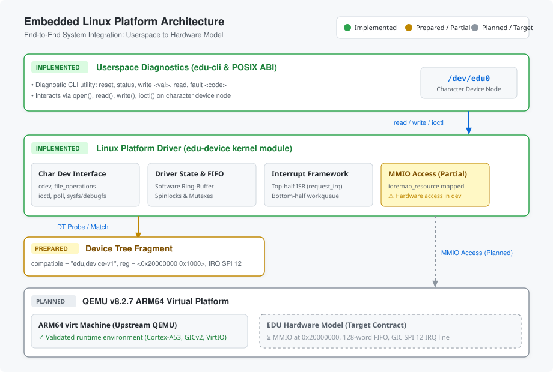
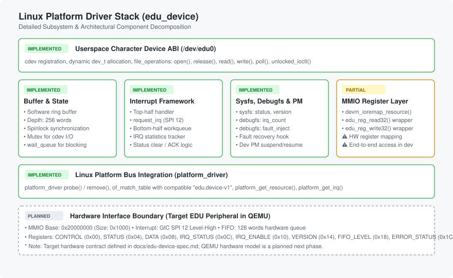
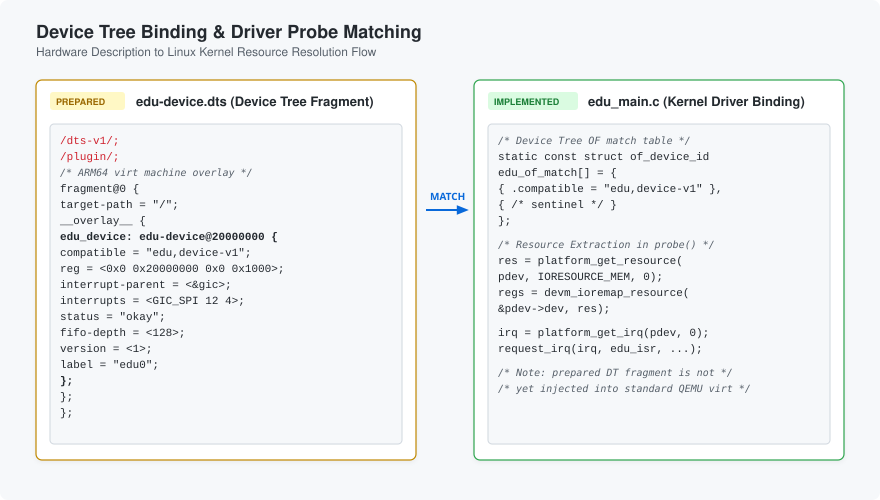
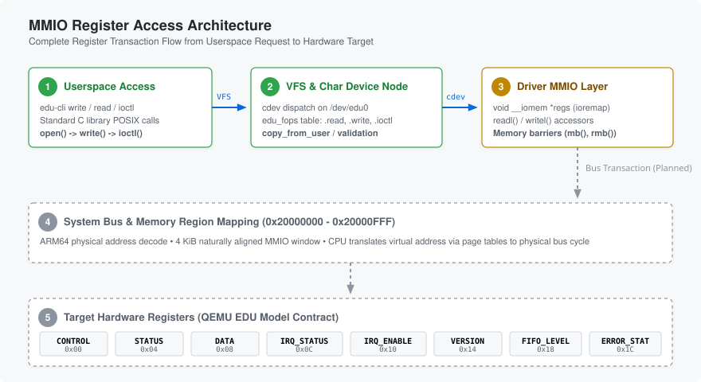
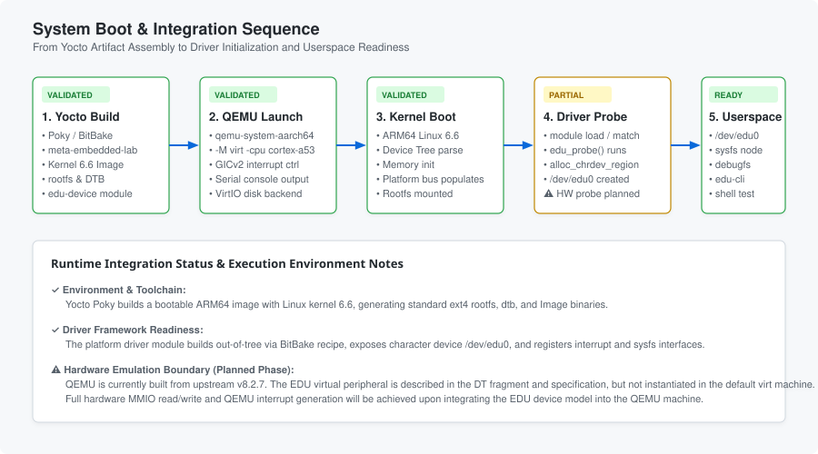

# Embedded Linux Platform

A production-oriented full-stack Embedded Linux platform integrating Yocto (Poky), Linux kernel drivers, Device Tree configuration, ARM64 emulation in QEMU, MMIO register modeling, and userspace diagnostics.

[](https://developer.arm.com/)
[](https://www.kernel.org/)
[](https://www.yoctoproject.org/)
[](https://www.qemu.org/)
[](https://github.com/abhijeet8684-beep/embedded-linux-platform)

---

## Architecture Overview



---

## Overview

This repository demonstrates the engineering workflow of an Embedded Linux platform targeting an ARM64 system. Rather than treating embedded development as isolated user applications, this project approaches the system end-to-end:
1. **Board Support & OS Construction:** Building a bootable Linux distribution using Yocto / OpenEmbedded (`meta-embedded-lab`).
2. **Kernel Driver Subsystem:** Writing an out-of-tree Linux platform driver (`edu-device`) with a standard POSIX character device interface (`/dev/edu0`), spinlock/mutex concurrency controls, and interrupt handlers.
3. **Hardware-Software Boundary:** Defining a rigorous register-level specification (`docs/edu-device-spec.md`) and Device Tree binding for a virtual educational peripheral ("EDU device").
4. **Userspace Diagnostic Tooling:** Implementing a userland CLI (`edu-cli`) to exercise read/write transfers, device resets, status checks, and fault recovery.

---

## What Did I Build?

This platform bridges userland utilities down to the register interface of a custom peripheral contract:

- **Custom Yocto Layer (`meta-embedded-lab`):** Integrates recipes for a custom minimal ARM64 image (`embedded-lab-image`), an out-of-tree kernel module recipe (`edu-device`), and the userspace utility (`edu-cli`).
- **Linux Platform Driver (`edu-device`):** Implements dynamic major/minor character device allocation, file operations (`open`, `release`, `read`, `write`, `poll`, `unlocked_ioctl`), memory-mapped I/O resource mapping (`devm_ioremap_resource`), top-half interrupt service routines with bottom-half workqueue handling, a 256-word software ring buffer, and `sysfs`/`debugfs` instrumentation.
- **Device Tree Overlay Fragment:** Provides an OpenFirmware description binding `compatible = "edu,device-v1"` to MMIO window `0x20000000 - 0x20000FFF` and GIC SPI interrupt line 12.
- **Diagnostic Client (`edu-cli`):** Userspace executable compiled via Yocto toolchain exposing subcommands for status verification, write/read transfers, software reset, and fault injection.

> **Hardware Emulation Roadmap:** The current QEMU integration utilizes upstream QEMU `v8.2.7` for ARM64 machine execution. The target EDU peripheral is formally specified in [`docs/edu-device-spec.md`](docs/edu-device-spec.md) and represents the hardware contract for the planned QEMU device model integration.

---

## Why This Project?

Traditional embedded tutorials often operate entirely in userspace or test kernel drivers against simulated mock data. Real-world systems require:
- Predictable register-level transactions over MMIO address spaces.
- Adherence to formal hardware specifications with strict endianness, reset states, and bitfield contracts.
- Device Tree driven discovery and resource mapping.
- Top-half/bottom-half interrupt handling with atomic synchronization.
- Deterministic error reporting and fault recovery under kernel supervision.

This project was built to model and validate these engineering boundaries within a reproducible Yocto and QEMU workflow.

---

## System Architecture

The software and hardware stack is organized into distinct layers:

| Layer | Component | Implementation Status | Responsibility |
|---|---|---|---|
| **Userspace** | `edu-cli` | Implemented | Diagnostic CLI providing command execution (`reset`, `status`, `write`, `read`, `fault`, `help`). |
| **Kernel ABI** | `/dev/edu0` | Implemented | Character device node created via `class_create()` and `device_create()`. |
| **Driver** | `edu-device.ko` | Implemented (Framework) | Linux platform driver managing cdev, software FIFO ring-buffer, workqueues, and sysfs/debugfs. |
| **Discovery** | Device Tree | Prepared | DTS fragment (`compatible = "edu,device-v1"`) describing base address `0x20000000` and GIC SPI 12. |
| **Platform** | QEMU ARM64 (`virt`) | Implemented | Emulated Cortex-A53 dual-core system executing Linux kernel 6.6.x. |
| **Peripheral** | EDU Virtual HW | Planned (Target Contract) | 4 KiB MMIO peripheral specified in `docs/edu-device-spec.md`. |

---

## Current Status

To maintain engineering integrity, the table below distinguishes between components that are implemented and validated versus planned milestones:

| Component | Repository Path | Status |
|---|---|---|
| Custom Yocto Layer (`meta-embedded-lab`) | `meta-embedded-lab/conf/layer.conf` | **Implemented** |
| ARM64 Minimal Image Recipe | `meta-embedded-lab/recipes-core/images/embedded-lab-image.bb` | **Implemented** |
| Kernel Module Recipe | `meta-embedded-lab/recipes-drivers/edu-device/edu-device.bb` | **Implemented** |
| Linux Platform Driver Framework | `meta-embedded-lab/recipes-drivers/edu-device/files/edu_main.c` | **Implemented** |
| Character Device (`/dev/edu0`) | `meta-embedded-lab/recipes-drivers/edu-device/files/edu_main.c` | **Implemented** |
| Software Ring Buffer (256-word) | `meta-embedded-lab/recipes-drivers/edu-device/files/edu_device.h` | **Implemented** |
| Sysfs & Debugfs Diagnostics | `meta-embedded-lab/recipes-drivers/edu-device/files/edu_debugfs.c` | **Implemented** |
| Userspace CLI (`edu-cli`) | `meta-embedded-lab/recipes-apps/edu-cli/files/edu-cli.c` | **Implemented** |
| Device Tree Overlay Fragment | `meta-embedded-lab/recipes-kernel/linux/files/edu-device.dts` | **Prepared** |
| Target EDU Hardware Specification | `docs/edu-device-spec.md` | **Defined** |
| QEMU Submodule (`v8.2.7`) | `qemu/` | **Integrated (Upstream)** |
| QEMU Custom EDU Hardware Model | `qemu/hw/misc/` | **Planned** |
| End-to-End Hardware MMIO Wiring | `edu_hw.c` to QEMU MMIO | **Planned** |
| End-to-End Hardware IRQ Path | QEMU GIC SPI 12 to Driver ISR | **Planned** |
| Hardware FIFO Synchronization | QEMU FIFO to Driver | **Planned** |

---

## Virtual EDU Device

The virtual educational peripheral is governed by the authoritative specification in [`docs/edu-device-spec.md`](docs/edu-device-spec.md).

### Target EDU Hardware Contract

The device defines a 4 KiB naturally-aligned memory-mapped I/O region starting at `0x20000000`:

| Offset | Register | Access | Reset Value | Definition & Purpose |
|---|---|---|---|---|
| `0x00` | `CONTROL` | RW | `0x00000000` | Master control: Bit 0 = `ENABLE`, Bit 1 = `RESET` (self-clearing), Bit 2 = `IRQ_ENABLE`. |
| `0x04` | `STATUS` | RO | `0x00000001` | Status indicators: Bit 0 = `READY`, Bit 1 = `DATA_AVAILABLE`, Bit 2 = `ERROR`. |
| `0x08` | `DATA` | RW | `0x00000000` | FIFO producer/consumer port for 32-bit word streaming. |
| `0x0C` | `IRQ_STATUS` | RW1C | `0x00000000` | Latched interrupt causes: DATA_READY, FIFO_OVERFLOW, FIFO_UNDERFLOW, INVALID_OP. |
| `0x10` | `IRQ_ENABLE` | RW | `0x00000000` | Interrupt enable mask corresponding to `IRQ_STATUS` causes. |
| `0x14` | `VERSION` | RO | `0x00010000` | Hardware specification contract version (v1.0.0). |
| `0x18` | `FIFO_LEVEL` | RO | `0x00000000` | Current count of valid 32-bit words queued in the hardware FIFO. |
| `0x1C` | `ERROR_STATUS` | RW1C | `0x00000000` | Latched sticky error causes: INVALID_OP, FIFO_OVERFLOW, FIFO_UNDERFLOW, BUS_FAULT. |

> *Note:* This register map represents the formal target contract. The driver defines the corresponding register offsets, accessors, and structs, while QEMU device model instantiation is planned for the subsequent development phase.

---

## Linux Driver

The `edu-device` Linux platform driver bridges the operating system to the peripheral:



### Driver Architecture
- **Platform Bus Binding:** Binds through the OpenFirmware match table matching `compatible = "edu,device-v1"`.
- **Resource Management:** Requests memory regions using `platform_get_resource(..., IORESOURCE_MEM, ...)` and maps physical pages with `devm_ioremap_resource()`.
- **Character Device ABI:** Allocates major/minor dynamic numbers (`alloc_chrdev_region`), registers a `cdev` instance, and populates `/dev/edu0` via Linux sysfs class helpers (`class_create` / `device_create`).
- **Concurrency & Synchronization:** Combines `spinlock_t` for interrupt-safe ring buffer manipulation with `mutex` locks for serializing userspace character device transactions.
- **Top-Half / Bottom-Half Interrupt Handling:** Registers an ISR via `request_irq()` on the assigned GIC SPI interrupt line, clearing latched hardware flags and scheduling an asynchronous bottom-half workqueue (`schedule_work(&edu->irq_work)`).
- **Diagnostics:** Exposes readouts through debugfs (`/sys/kernel/debug/edu0/irq_count`) and sysfs attributes.
- **Power Management:** Implements `dev_pm_ops` with `edu_pm_suspend` and `edu_pm_resume` hooks.

> *Implementation Note:* The driver currently provides the kernel-side infrastructure and internal ring buffer. Direct runtime register communication with an active hardware endpoint is in progress.

---

## Device Tree

The peripheral is described via an OpenFirmware Device Tree fragment:



```dts
/dts-v1/;
/plugin/;

#include <dt-bindings/interrupt-controller/arm-gic.h>
#include <dt-bindings/interrupt-controller/irq.h>

/ {
    compatible = "qemu,virt";

    fragment@0 {
        target-path = "/";
        __overlay__ {
            edu_device: edu-device@20000000 {
                compatible = "edu,device-v1";
                reg = <0x0 0x20000000 0x0 0x1000>;
                interrupt-parent = <&gic>;
                interrupts = <GIC_SPI 12 IRQ_TYPE_LEVEL_HIGH>;
                status = "okay";
                fifo-depth = <128>;
                version = <1>;
                label = "edu0";
            };
        };
    };
};
```

- **`compatible`:** Matches the `.compatible` entry in the driver's `of_device_id` table (`"edu,device-v1"`).
- **`reg`:** Allocates a 4 KiB window at base address `0x20000000`.
- **`interrupts`:** Connects to ARM Generic Interrupt Controller (GIC) Shared Peripheral Interrupt (SPI) line 12 as a Level-High interrupt.
- **`fifo-depth`:** Declares the hardware FIFO capacity (128 words).

> *Note:* The Device Tree overlay is prepared in `meta-embedded-lab/recipes-kernel/linux/files/edu-device.dts`. Standard QEMU virt boot does not currently instantiate this custom node out-of-the-box.

---

## MMIO Register Model

Memory-Mapped I/O operations follow a strict traversal path through the kernel memory subsystems:



1. **Userspace Invocation:** `edu-cli` triggers POSIX standard file operations (`read`, `write`, `ioctl`).
2. **VFS Dispatch:** Virtual File System dispatches through `struct file_operations edu_fops`.
3. **Driver I/O Accessors:** The driver accesses registers using standard kernel helpers (`readl`, `writel`) with memory barriers (`mb()`, `rmb()`, `wmb()`) to enforce instruction ordering across bus fabrics.
4. **Physical Bus Transaction:** CPU memory management units translate virtual pointers through mapped page tables to address `0x20000000`.
5. **Target Hardware Endpoint:** Target QEMU SysBus device receives transactions and triggers device state updates.

---

## Userspace Interface

The diagnostic application `edu-cli` interacts directly with `/dev/edu0`:

```bash
# Display help and supported commands
edu-cli help

# Query driver and hardware status
edu-cli status

# Write a 32-bit word into the device buffer
edu-cli write 0xDEADBEEF

# Read a 32-bit word from the device buffer
edu-cli read

# Trigger device reset sequence
edu-cli reset

# Trigger simulated fault injection test
edu-cli fault 1
```

Supported commands:
- `help` / `--help`: Displays syntax and options.
- `status`: Reads driver runtime status flags.
- `write <value>`: Transmits a 32-bit integer to the device buffer.
- `read`: Receives a 32-bit integer from the device buffer.
- `reset`: Issues a reset request via `EDU_IOC_RESET`.
- `fault <code>`: Issues a test fault injection code via `EDU_IOC_FAULT_INJECT`.

---

## Yocto / OpenEmbedded

The platform build is orchestrated using BitBake and OpenEmbedded within `meta-embedded-lab`:

```
meta-embedded-lab/
├── conf/
│   └── layer.conf                          # Layer priority, pattern, and dependencies
├── recipes-apps/
│   └── edu-cli/
│       ├── edu-cli.bb                      # Toolchain compilation and packaging recipe
│       └── files/
│           ├── edu-cli.c                   # Userspace C source
│           └── Makefile                    # Native build targets
├── recipes-core/
│   └── images/
│       └── embedded-lab-image.bb           # Minimal rootfs assembly (base-files, udev, etc.)
├── recipes-drivers/
│   └── edu-device/
│       ├── edu-device.bb                   # Out-of-tree kernel module recipe (module class)
│       └── files/
│           ├── Makefile                    # Kbuild integration
│           ├── edu_device.h                # Driver data structures & register macros
│           ├── edu_main.c                  # Probe/remove, cdev, fops implementation
│           ├── edu_hw.c                    # MMIO register access helpers
│           ├── edu_irq.c                   # Interrupt request, top/bottom half handlers
│           └── edu_debugfs.c               # Debugfs instrumentation
└── recipes-kernel/
    └── linux/
        ├── files/
        │   └── edu-device.dts              # Device Tree overlay fragment
        └── linux-yocto_%.bbappend          # Kernel configuration append and DT inclusion
```

### Build Commands

```bash
# 1. Initialize Poky build environment
source poky/oe-init-build-env build-qemuarm64

# 2. Add custom layer to bblayers.conf
bitbake-layers add-layer ../meta-embedded-lab

# 3. Build the minimal ARM64 embedded Linux image
bitbake embedded-lab-image
```

---

## QEMU Environment

- **Architecture:** ARM64 (aarch64)
- **Machine Type:** `virt`
- **CPU Model:** `cortex-a53` (SMP dual-core)
- **QEMU Release:** `v8.2.7` tracked as a Git submodule (`qemu/`)
- **Build Wrapper:** `tools/build-qemu.sh` compiles an out-of-tree QEMU binary with unnecessary host dependencies disabled.

```bash
# Build out-of-tree QEMU binary
./tools/build-qemu.sh
```

---

## Boot & Execution Flow



---

## Validation

Engineering progress is tracked with factual validation statuses:

| Test / Verification Case | Scope | Result | Details |
|---|---|---|---|
| Driver Ring Buffer Host Unit Test | Host | **PASS** | Validates enqueue, dequeue, wrapping, and overflow guards in standalone C test harness. |
| `edu-cli` Toolchain Compilation | Host / Cross | **PASS** | Builds cleanly with GCC under `-Wall -Wextra -Werror` flags. |
| `edu-cli --help` Invocation | Host CLI | **PASS** | CLI parameter parser executes and prints full usage documentation. |
| GitHub Actions CI Pipeline | Host CI | **PASS** | Validates compilation, shell scripts, and documentation consistency on pull requests. |
| Yocto `embedded-lab-image` Build | Target Build | **Previously Validated** | Verified in initial platform milestone; requires local BitBake environment to reproduce. |
| ARM64 Kernel Boot in QEMU | System Boot | **Previously Validated** | Kernel boots to login prompt using standard upstream QEMU virt machine. |
| Live Device Tree Injection in QEMU | Integration | **Planned** | Loading `edu-device.dtb` alongside virt base tree. |
| End-to-End MMIO Hardware Access | Runtime HW | **Planned** | Validating physical register reads/writes against QEMU device model. |
| Hardware Interrupt Firing & ISR | Runtime HW | **Planned** | Asserting GIC SPI 12 from QEMU and capturing in kernel bottom-half workqueue. |

---

## Repository Structure

```
embedded-linux-platform/
├── .github/
│   └── workflows/
│       └── ci.yml                          # Continuous integration checks
├── docs/
│   ├── images/
│   │   ├── architecture-overview.svg       # End-to-end system architecture
│   │   ├── linux-driver-stack.svg          # Subsystem driver decomposition
│   │   ├── mmio-register-flow.svg          # MMIO transaction traversal
│   │   ├── boot-flow.svg                   # Boot sequence & integration
│   │   └── device-tree-flow.svg            # Device tree matching sequence
│   ├── edu-device-spec.md                  # Target EDU peripheral hardware specification
│   ├── environment-baseline.md             # Host environment dependencies
│   └── qemu-development.md                 # QEMU submodule integration notes
├── meta-embedded-lab/                      # Custom Yocto platform layer
├── qemu/                                   # QEMU v8.2.7 upstream submodule
├── tools/
│   └── build-qemu.sh                       # Out-of-tree QEMU build helper script
└── README.md                               # Project documentation
```

---

## Engineering Challenges

1. **Hardware State vs. Driver Software State:** Early driver designs risked maintaining shadow state for register values and errors. Aligning with the formal specification required treating the hardware registers as the single source of truth for device status and interrupts.
2. **Kernel 6.6 Concurrency & API Changes:** Modern Linux kernel versions (6.6 LTS) deprecate legacy APIs. The driver utilizes modern `class_create(EDU_NAME)`, `devm_ioremap_resource()`, and atomic lock ordering between spinlocks and mutexes.
3. **Out-of-Tree QEMU Integration:** Managing QEMU alongside Yocto required pinning a stable submodule (`v8.2.7`) with isolated prefix build scripts to prevent host toolchain pollution.
4. **Separation of Hardware Specification from Runtime Verification:** Maintaining strict boundary definitions between what is implemented in software versus what requires active hardware emulation.

---

## Roadmap

- [x] **Phase 1: Environment & Toolchain:** Custom Yocto layer structure, minimal image configuration, and build scripts.
- [x] **Phase 2: Driver & Userspace Framework:** Linux platform driver skeleton, character device, ring buffer, sysfs/debugfs, and CLI tool.
- [x] **Phase 3: Formal Hardware Specification:** Comprehensive register-level specification (`docs/edu-device-spec.md`) and Device Tree fragment.
- [ ] **Phase 4: QEMU Device Model:** Implement SysBus EDU peripheral model (`hw/misc/edu-device.c`) within QEMU submodule.
- [ ] **Phase 5: Machine Mapping & DT Activation:** Instantiate EDU device in QEMU virt machine at `0x20000000` with GIC SPI 12.
- [ ] **Phase 6: End-to-End MMIO Integration:** Align driver MMIO functions to live QEMU registers; verify `VERSION` read (`0x00010000`).
- [ ] **Phase 7: Hardware Interrupts & FIFO:** Wire hardware FIFO and level-triggered interrupts from QEMU into kernel ISR.
- [ ] **Phase 8: Automated Test Suite:** Implement QTest test cases and automated QEMU boot validation in CI.

---

## Documentation

- [EDU Device Hardware Specification](docs/edu-device-spec.md)
- [QEMU Development & Submodule Notes](docs/qemu-development.md)
- [Environment Baseline](docs/environment-baseline.md)

---

## Author

**Abhijeet**
GitHub: [https://github.com/abhijeet8684-beep](https://github.com/abhijeet8684-beep)
Repository: [embedded-linux-platform](https://github.com/abhijeet8684-beep/embedded-linux-platform)
